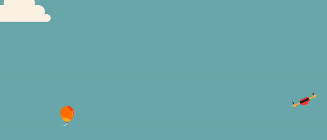

# A Simulation of Modelling And Control of 2D UAV to reach a Target

## Project Structure

├── CMakeLists.txt
├── README.md
├── assets
├── build1
├── helper
│   ├── helper.cpp
│   └── helper.h
├── main.cpp
├── player
│   ├── player.cpp
│   └── player.h
├── stats.py
└── variables
    └── variables.h

<!-- Information for the project -->

For running the code you need to download SFML and necessary compilers for running C++.

<!-- Another way to see the implementation -->

Another gif file is provided for visualisation of the implementation

